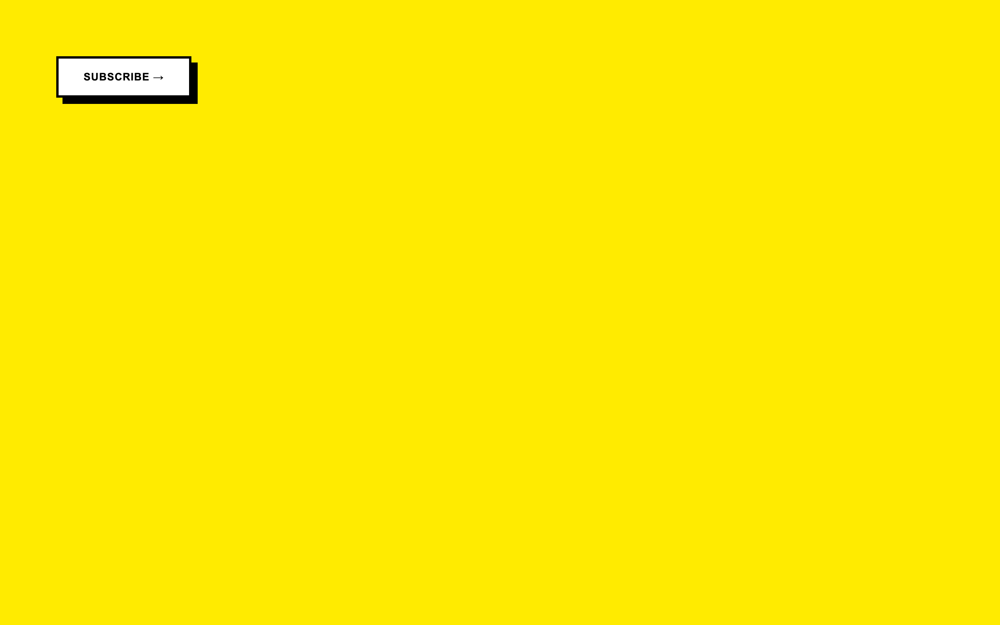
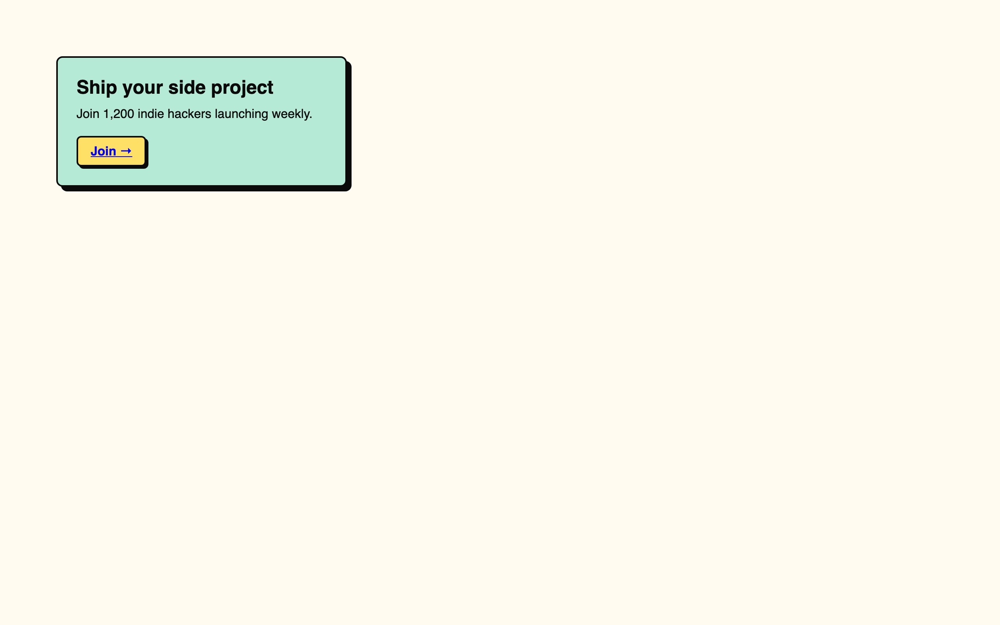
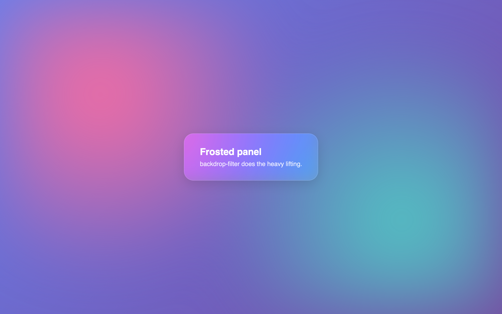
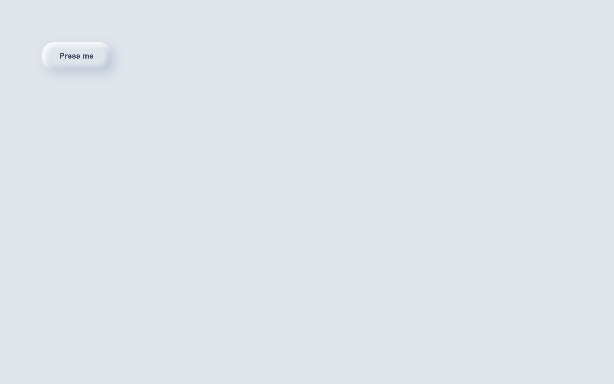
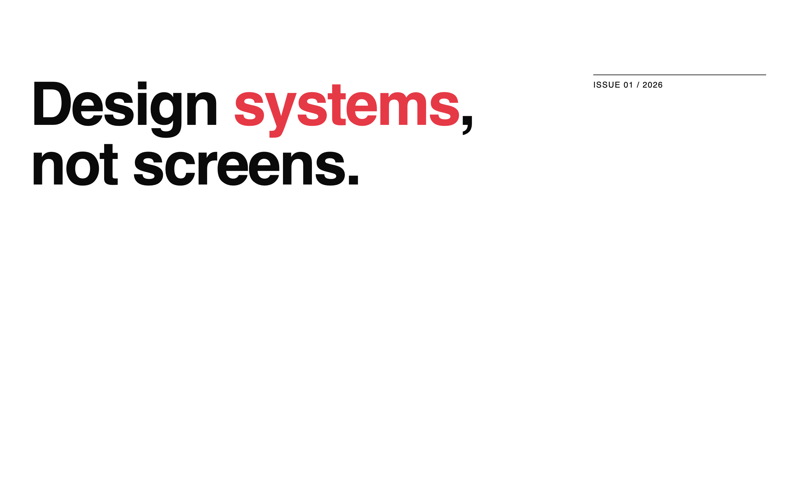
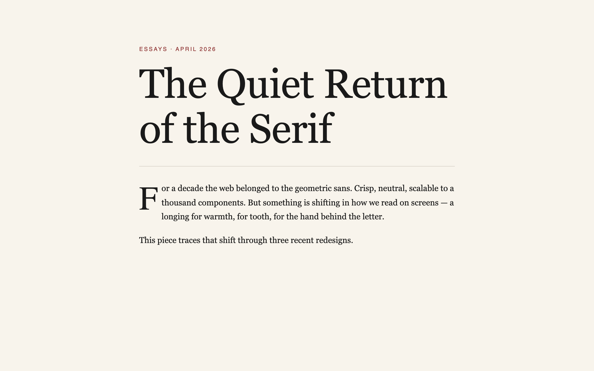
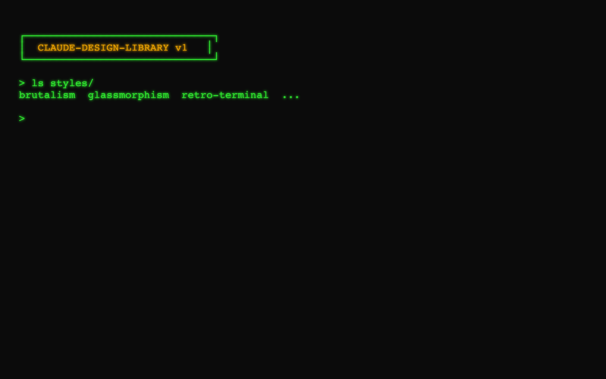

# Styles

Named visual styles, each with a `style.md` description, a `tokens.json` design-token file, and at least one example.

Ask Claude: *"Fetch `styles/<slug>/tokens.json` and use it to style my page."*

| Preview | Style | Mood |
| :---: | --- | --- |
|  | **[Brutalism](./brutalism)** | Raw, bold, confrontational |
|  | **[Neo-Brutalism](./neobrutalism)** | Playful brutalism with color |
|  | **[Glassmorphism](./glassmorphism)** | Frosted, translucent, layered |
|  | **[Claymorphism](./claymorphism)** | Soft, puffy, tactile |
|  | **[Minimal / Swiss](./minimal-swiss)** | Grid-led, restrained, typographic |
|  | **[Editorial Magazine](./editorial-magazine)** | Serif-heavy, print-inspired |
|  | **[Retro Terminal](./retro-terminal)** | Monospace, scanlines, phosphor |
|  | **[Skeuomorphic](./skeuomorphic)** | Realistic textures, depth |

---

All previews are auto-generated via `npx tsx scripts/screenshot.ts` (Playwright + Chromium). They are screenshots of our own MIT-licensed example files in each `examples/` folder.
