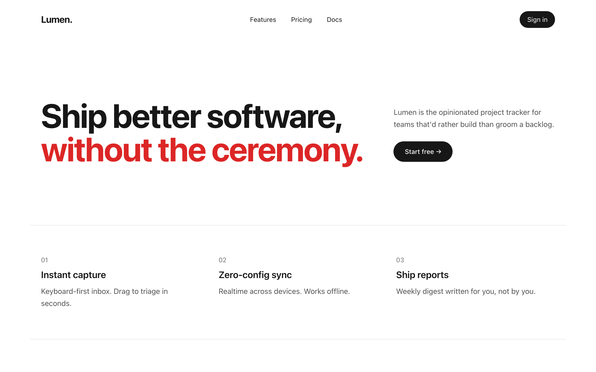
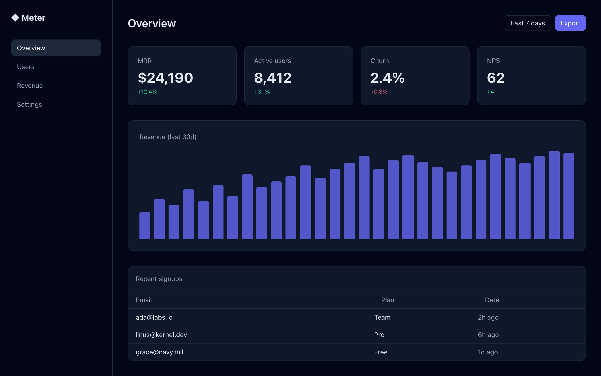
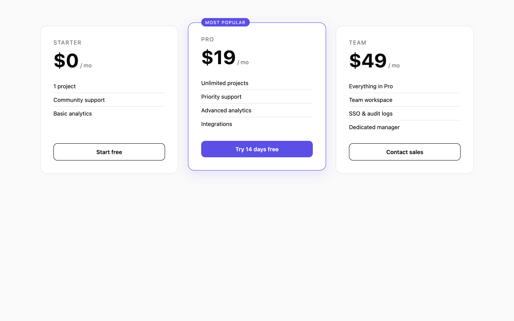

# Templates

Two kinds of entries live here:

1. **In-repo templates** — actual HTML/code we ship (`landing-pages/`, `dashboards/`, `components/`). Open the `index.html` directly in a browser.
2. **External template references** — pointers to upstream open-source repos (`admin/`, `kits/`). The `.md` files describe the repo, the code lives upstream.

## In-repo

| Preview | Template | What |
| :---: | --- | --- |
|  | **[saas-minimal](./landing-pages/saas-minimal)** | Minimal B&W SaaS landing (Tailwind CDN) |
|  | **[analytics-dark](./dashboards/analytics-dark)** | Dark analytics dashboard (Tailwind CDN) |
|  | **[pricing-table](./components/pricing-table)** | 3-tier pricing component (vanilla CSS) |

## External admin templates

| Slug | Stack | Upstream |
| --- | --- | --- |
| [vue-element-admin](./admin/vue-element-admin.md) | Vue 2 + Element | PanJiaChen/vue-element-admin |
| [vue-vben-admin](./admin/vue-vben-admin.md) | Vue 3 + Vite + TS | vbenjs/vue-vben-admin |
| [tabler-admin](./admin/tabler.md) | Bootstrap | tabler/tabler |
| [coreui-react-admin](./admin/coreui-react.md) | React + Bootstrap | coreui/coreui-free-react-admin-template |
| [soft-ui-dashboard-tailwind](./admin/soft-ui-dashboard-tailwind.md) | Tailwind | creativetimofficial/soft-ui-dashboard-tailwind |
| [mantis-free-react](./admin/mantis-free-react.md) | React + MUI | codedthemes/mantis-free-react-admin-template |
| [next-shadcn-dashboard-starter](./admin/next-shadcn-dashboard-starter.md) | Next 14 + shadcn | Kiranism/next-shadcn-dashboard-starter |
| [taxonomy](./admin/shadcn-taxonomy.md) | Next 13 + shadcn | shadcn-ui/taxonomy |

## External component/block kits

| Slug | Stack | Upstream |
| --- | --- | --- |
| [hyperui](./kits/hyperui.md) | Tailwind | markmead/hyperui |
| [meraki-ui](./kits/meraki-ui.md) | Tailwind (RTL) | merakiui/merakiui |
| [tailblocks](./kits/tailblocks.md) | Tailwind | mertJF/tailblocks |
| [material-tailwind](./kits/material-tailwind.md) | Tailwind + React | creativetimofficial/material-tailwind |
| [float-ui](./kits/float-ui.md) | Tailwind + React | Float-UI/floatui |
| [astrofy](./kits/astrofy.md) | Astro | manuelernestog/astrofy |
| [nextjs-commerce](./kits/nextjs-commerce.md) | Next + React | vercel/commerce |
